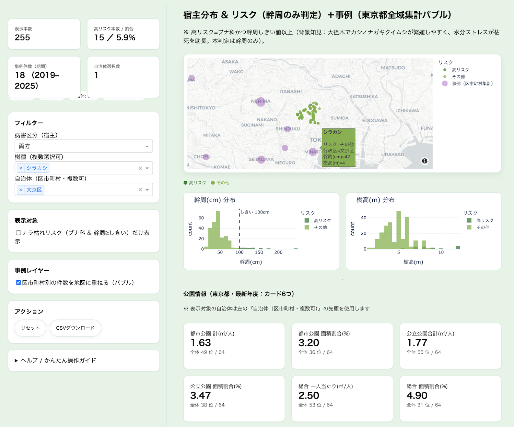
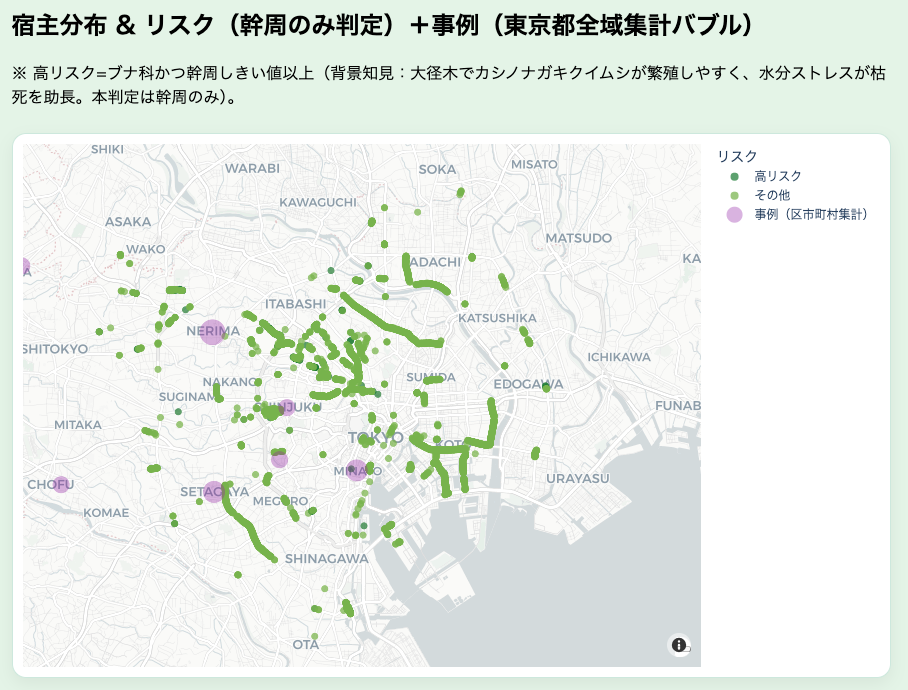
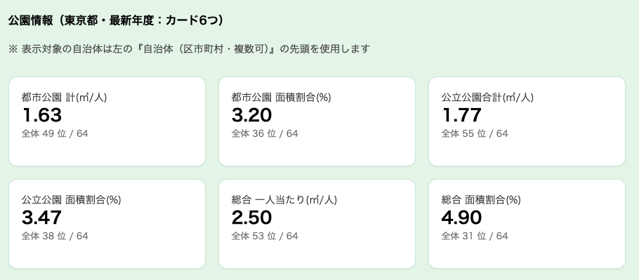
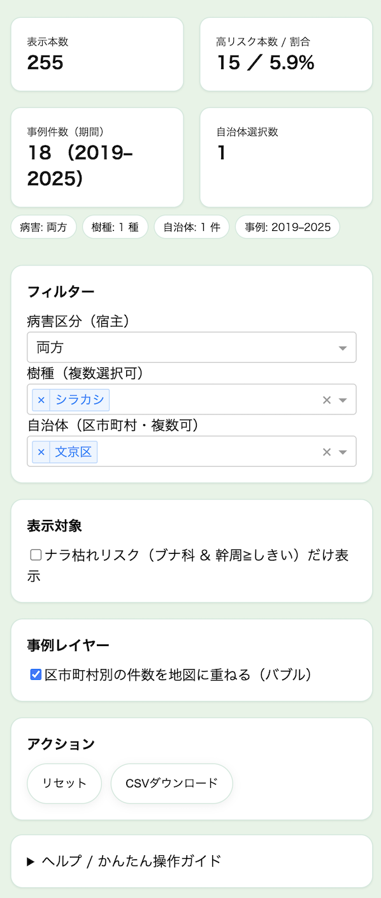
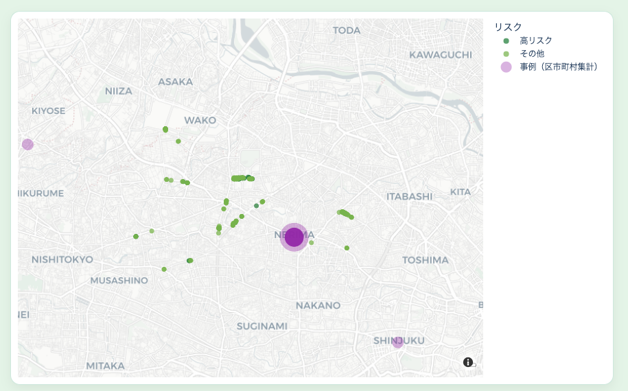
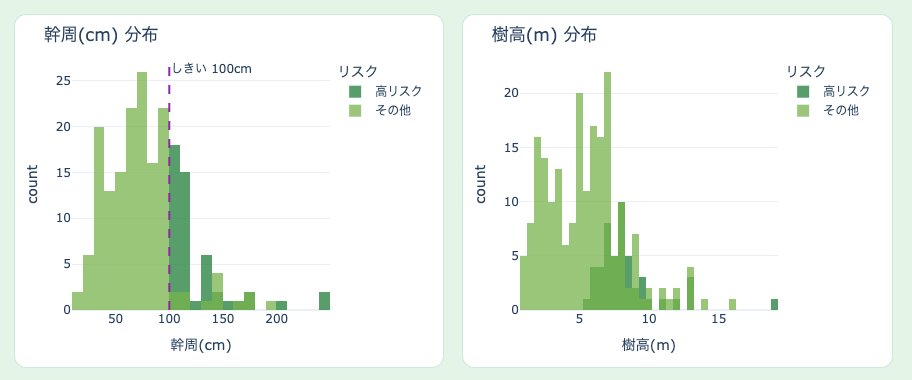

# マツ枯れ・ナラ枯れ 広域可視化ダッシュボード

街路樹と公園の**オープンデータ**、および**公開情報から検索して収集した被害実例**を統合し、  
地図と指標で「いま起きていること」と「起こりやすい場所」を可視化する Dash ベースのダッシュボードです。

- **地図**：起こりやすい条件の木（樹種 × 幹の太さ）＋ 自治体別の被害件数（バブル重畳）
- **グラフ**：幹の太さ・樹高の分布（しきい値を表示）
- **公園カード**：自治体別の 6 指標＋全体順位（影響度の相対比較）
- **目的**：境界横断の優先順位付け、巡視計画・資機材配置の効率化、効果検証と説明の根拠提示

---

## ダッシュボード

- トップ画面  
  

- 地図（起こりやすい条件の木 × 被害バブル）  
  

- 公園カード（6 指標＋全体順位）  
  

---

## リポジトリ構成

```
.
├─ dash_app_final.py   # ダッシュボード本体（Dash）
├─ tokyo_gairoju.csv                             # 街路樹のオープンデータ
├─ incidents_tokyo.csv                           # 被害実例
├─ tokyo_municipality_centroids.csv              # 自治体の重心座標
├─ 000027629.csv                                 # 東京都 公園統計
├─ requirements.txt                              # 依存パッケージ
└─ docs/
   └─ images/                                    
```

---

## 必要環境

- Python 3.10 以上（Windows / macOS / Linux いずれも可）
- ブラウザ（最新の Chrome / Edge / Firefox 等）
- Mapbox トークン不要（地図タイルは Carto-Positron を使用）

---

## 表示環境（推奨解像度）

- **推奨解像度**：1920×1080（フルHD）

### 他の解像度での注意
- ウィンドウ幅が狭い場合、カードの並び数や余白が変化し、要素の折り返しや縦スクロール量が増えることがあります。
- 1366×768 などの画面では、グラフや表が重なって見える・一部が見切れる可能性があります。
- スマートフォン等のモバイル画面は最適化対象外です。

---

## セットアップと起動

1) 依存パッケージのインストール
```bash
pip install -r requirements.txt
```

2) アプリの起動
```bash
python dash_app_final.py
```

コンソールに表示される URL（例：`http://127.0.0.1:8050`）をブラウザで開いてください。

---

## データの出どころ

- **街路樹データ**：自治体のオープンデータ（樹種、位置、幹周、樹高 など）  
  - 【ファイル名】[街路樹（都道：23区）CSV（csvファイル）](https://catalog.data.metro.tokyo.lg.jp/dataset/t000014d2000000029)
- **公園統計**：東京都の公園に関する統計（最新年度）  
  - 【ファイル名】[東京都都市公園等区市町村別面積・人口割比率表（平成28年4月1日現在）（csvファイル）](https://catalog.data.metro.tokyo.lg.jp/dataset/t000014d0000000003)
- **被害実例**：自治体や報道等の公開情報を検索して収集（自治体名と年を付与）

> 注：被害バブルは「自治体別の総数」を地図に重ねています。正確な発生位置を示すものではありません。

---

## データ処理（概要）

1. **表記ゆれ修正・標準化**  
   列名の正規化（全角→半角、カッコの統一、スペース除去 等）
2. **数値化**  
   幹周・樹高を数値化、緯度経度の欠損除外
3. **“起こりやすい条件”の抽出**  
   例：ナラ/カシなど（ブナ科に該当）かつ **幹周がしきい値以上（本スクリプトでは 100cm 固定）**
4. **被害実例の集計**  
   自治体別に件数を集計（`year` が無い場合は `date` から年を抽出）
5. **重心との突合**  
   `tokyo_municipality_centroids.csv` の `lat_c`, `lon_c` と結合してバブル位置に使用
6. **公園指標の整理**  
   6 指標に整形し、合計行を除外した上で全体順位を算出

---

## ダッシュボードの使い方

### 1) 画面全体の構成
左側に**操作パネル**、右側に**地図・ヒストグラム・公園カード**が並びます。  
操作パネルでは、対象を絞り込んだり、表示内容を切り替えたりできます。


### 2) 左側パネル（操作一覧）


- **フィルター**
  - **病害区分**：両方 / マツ枯れ対象 / ナラ枯れ対象
  - **樹種**：複数選択可（未選択＝すべて）
  - **自治体（区市町村）**：複数選択可（未選択＝全域）  
    ※ ここで選んだ**先頭の自治体**が、公園カード（6 指標）の表示対象になります。

- **表示対象**
  - **起こりやすい条件の木のみ表示**：オンにすると、例として「ナラ/カシ類 × 幹周 100cm 以上」に該当する木だけを地図に表示します。

- **事例レイヤー**
  - **自治体別の件数バブルを地図に重ねる**：オン/オフ切り替え。件数が多いほどバブルが大きく表示されます。

- **アクション**
  - **リセット**：現在の選択をすべてクリア（初期状態に戻します）。
  - **CSV ダウンロード**：現在の条件に一致する木の一覧と、自治体別の被害件数（集計）を同梱して出力。

- **備考**
  - 幹周の**しきい値は 100cm 固定**（UI ではスライダー非表示）。
  - 地図の背景は Carto-Positron（トークン不要）。

### 3) 地図の見方
- **緑の点**：起こりやすい条件に該当する木（例：ナラ/カシ類 × 幹周 100cm 以上）  
- **マゼンタのバブル**：自治体別の被害実例件数（件数の平方根スケーリングでサイズ可変）

点の密集と大きなバブルが重なるエリアほど、優先的な確認・対策が必要な可能性が高いと判断できます。



### 4) 幹周・樹高の分布（ヒストグラム）
- 幹周（cm）の分布は、**しきい値の破線**で「太い木」の目安を可視化  
- 樹高（m）の分布も合わせて確認し、対策前後の変化を比較



### 5) 公園カード（6 指標＋全体順位）
選択した自治体について、以下のような指標を 6 枚カードで表示し、全体順位も付与します（列名は公園統計 CSV に依存）。

- 一人当たりの都市公園面積  
- 都市公園面積の割合  
- 公立公園合計の一人当たり面積  
- 公立公園面積の割合  
- 総合の一人当たり面積  
- 総合の面積割合


> 使い方の例：  
> 1) 地図で「点の密集」＋「大きなバブル」が重なる自治体を確認  
> 2) 公園カードの順位で、同じ被害でも**影響が大きい自治体**を特定  
> 3) **リスク × 影響**の高い順に、巡視・剪定・伐採や一時規制などを検討

---

## CSV の列仕様（添付ファイルに基づく）

### `tokyo_gairoju.csv`（街路樹）
- 主に使用する列：`行政区`, `樹種`, `緯度`, `経度`, `幹周(cm）`, `樹高(m)`
- 備考：`幹周(cm）` は **閉じカッコが全角**です（処理側で `幹周(cm)` に正規化して使用）

**元ファイルの主な列**
- `樹種`, `区分`, `樹高(m)`, `枝張(m)`, `幹周(cm）`, `行政区`, `種別`, `整理番号`, `路線名`, `通称道路名`, `経度`, `緯度`

---

### `incidents_tokyo.csv`（被害実例）
- ダッシュボードで主に用いる列：`disease`, `year`（または `date`）, `ward_city`, `source_title`, `source_url`
- 位置情報は任意：`lat`, `lon` は**このファイルには含まれていません**（自治体別の件数を地図に重畳）
- 追加情報（任意活用可）：`location_name`, `species`, `count_estimate`, `source_publisher`, `notes`

**元ファイルの列**
- `disease`, `year`, `date`, `ward_city`, `location_name`, `species`, `count_estimate`, `source_publisher`, `source_title`, `source_url`, `notes`

---

### `tokyo_municipality_centroids.csv`（自治体重心）
- 使用列：`ward_city`, `lat_c`, `lon_c`
- 参考列：`muni_type`（市/区/町などの別。表示には必須ではありません）

**元ファイルの列**
- `ward_city`, `lat_c`, `lon_c`, `muni_type`

---

### `000027629.csv`（東京都 公園統計）
- キー列：`行政区分`, `人口(B)(人)`
- 指標（ダッシュボードのカード/順位で使用）
  - `都市公園一人当たり面積(ｲ/B)(平米)`
  - `都市公園面積の割合(ｲ/A)(%)`
  - `公立公園一人当たり面積`：`国都区市町村立公園一人当たり面積(八/B)(平米)`
  - `公立公園面積の割合`：`国都区市町村立公園面積の割合(八/A)(%)`
  - `総合 一人当たり面積`：`一人当たり面積(ﾎ/B)(平米)`
  - `総合 面積の割合`：`面積の割合(ﾎ/A)(%)`
- ブレークダウン（件数・面積）
  - 都立：`都市公園都立公園数`, `都市公園都立公園面積平米`
  - 区市町村立：`都市公園区市町村立公園数`, `都市公園区市町村立公園面積平米`
  - 国営：`都市公園国営公園数`, `都市公園国営公園面積平米`
  - 都市公園 計：`都市公園の計数`, `都市公園の計面積平米`
  - 公立公園 合計：`国都区市町村立公園公立公園合計((八)ｲ+口)数`, `…面積平米`
  - 総合 計：`総合計((ﾎ)八+二)数`, `総合計((ﾎ)八+二)面積平米`
- 備考：`行政区分` に「○○計」等の**合計行**が含まれるため、**順位計算からは除外**しています。

**元ファイルの主な列**
- `行政区分`, `面積(A)(平方キロメートル)`, `人口(B)(人)`,
- `都市公園都立公園数`, `都市公園都立公園面積平米`,
- `都市公園区市町村立公園数`, `都市公園区市町村立公園面積平米`,
- `都市公園国営公園数`, `都市公園国営公園面積平米`,
- `都市公園の計数`, `都市公園の計面積平米`,
- `都市公園一人当たり面積(ｲ/B)(平米)`, `都市公園面積の割合(ｲ/A)(%)`,
- `国都区市町村立公園公立公園合計((八)ｲ+口)数`, `…面積平米`,
- `国都区市町村立公園一人当たり面積(八/B)(平米)`, `国都区市町村立公園面積の割合(八/A)(%)`,
- `総合計((ﾎ)八+二)数`, `総合計((ﾎ)八+二)面積平米`,
- `一人当たり面積(ﾎ/B)(平米)`, `面積の割合(ﾎ/A)(%)` ほか
